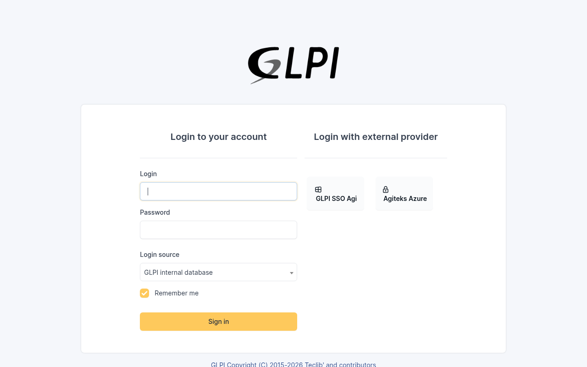
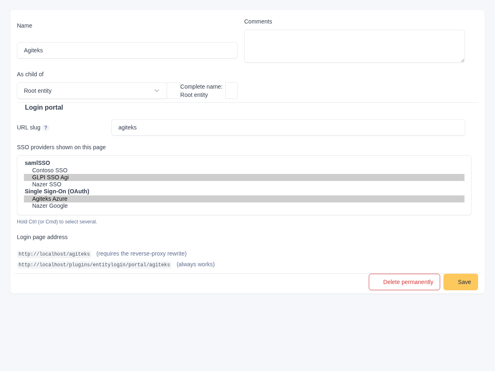
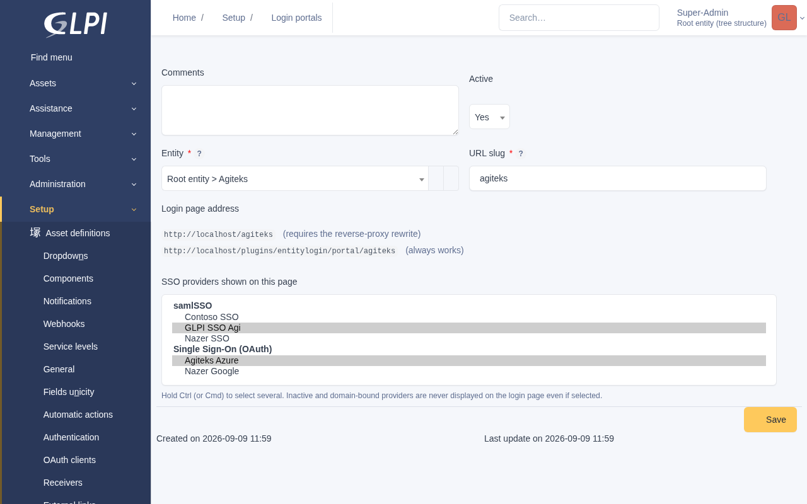

# Entity Login Portals

Give every GLPI entity its own login page, showing only that entity's SSO providers.

| URL | What the visitor sees |
|---|---|
| `https://glpi.example.com/` | The login form — **no SSO buttons at all** |
| `https://glpi.example.com/acme` | The login form + **only** Acme's SSO |
| `https://glpi.example.com/globex` | The login form + **only** Globex's SSO |



## Why

When several organisations share one GLPI, every configured SSO provider is
listed on the same login page. Ten organisations means ten buttons, and every
user sees all of them — including the ones belonging to other customers.

The supported SSO plugins have no notion of entities at login time: they list
every provider they know about. This plugin adds that missing layer.

## Supported SSO plugins

| Plugin | Key | Protocol |
|---|---|---|
| [samlSSO](https://github.com/DonutsNL/samlsso) | `samlsso` | SAML 2.0 |
| [Single Sign-On](https://github.com/edgardmessias/glpi-singlesignon) | `singlesignon` | OAuth 2.0 / OpenID Connect |

Providers from both can be mixed on a single portal. At least one must be
installed for portals to have anything to show.

Support for another SSO plugin is a matter of implementing one interface — see
[Adding another SSO plugin](#adding-another-sso-plugin).

## Requirements

- GLPI **11.0.x**
- PHP **8.2+**
- One of the supported SSO plugins
- A reverse proxy, *only* if you want the short `/acme` URLs (see below)

## Installation

1. Download the release archive and extract it into GLPI's plugin directory, so
   that the folder is named **`entitylogin`**:

   ```
   <GLPI_ROOT>/plugins/entitylogin/
   ```

   On Docker installs the marketplace directory is usually the one on a
   persistent volume — use whichever of `plugins/` or `marketplace/` survives a
   container rebuild on your setup.

2. Install and enable it under **Setup > Plugins**, or from the CLI:

   ```bash
   php bin/console glpi:plugin:install --username=<admin> entitylogin
   php bin/console glpi:plugin:activate entitylogin
   ```

3. Create portals under **Setup > Login portals**.

> **Enabling the plugin immediately removes all SSO buttons from the generic
> login page.** That is the point of the plugin, but until you have created
> portals and (optionally) added the proxy rewrite, users have no SSO button to
> click. On a live system, prepare the portals and the proxy first, then enable.

## Configuration

The quickest way is on the entity itself: **Administration > Entities**, open or
create an organisation, and fill in the **Login portal** section. A new entity
can be created with its slug and providers in a single step.



Clearing the slug removes that entity's portal; deleting the entity removes it
too. Creating an entity does **not** create a portal on its own — a portal needs
a slug and a set of providers, and neither can be derived from the entity.

**Setup > Login portals** lists every portal, and is also where you can manage
them independently of the entity form:



Slugs are lowercase letters, digits, dashes and underscores. GLPI's own
top-level paths (`front`, `ajax`, `css`, `install`, …) are rejected.

Every portal shows two addresses:

- the **short** URL (`/acme`) — needs the proxy rewrite below;
- the **direct** URL (`/plugins/entitylogin/portal/acme`) — always works.

Inactive providers, and samlSSO providers bound to an e-mail domain, are never
shown on a portal even if selected: the SSO plugin itself would not offer them
as a button.

## Short URLs

GLPI forces every plugin route under `/plugins/<key>/` or `/marketplace/<key>/`
(see `Glpi\Routing\PluginRoutesLoader`), so a plugin cannot claim a root-level
URL by itself. The short form is produced by rewriting it at the reverse proxy,
which leaves the address bar untouched.

> This cannot be done with an Apache rewrite *inside* GLPI's own container: an
> internal rewrite does not change `REQUEST_URI`, which is what Symfony routes
> on, and current Symfony no longer honours `X-Rewrite-URL`. It has to happen
> before the request reaches GLPI.

The rewrite matches only a **single-segment, lowercase, dot-free** path, and
excludes the paths GLPI owns at the root. Those exclusions are **required**, not
defensive: `/css`, `/js`, `/lib`, `/pics` and `/sound` are real directories that
match the slug shape, and rewriting them breaks every stylesheet on the site.

Adjust `<glpi-upstream>` and, if your plugin lives in the marketplace directory,
change `/plugins/` to `/marketplace/` in the replacement.

### nginx

PCRE supports lookahead, so the exclusions fit inside the pattern. Place this
**before** the catch-all `location /`.

```nginx
location ~ "^/(?!front|progress|index|api|apirest|caldav|status|plugins|marketplace|public|css|js|lib|pics|sound|files|config|install|vendor|node_modules|locales|templates|resources|bin|src|tests|tools|scripts|cache|schema)([a-z0-9][a-z0-9_-]{1,63})/?$" {
    set $portal_slug $1;
    proxy_pass http://<glpi-upstream>/plugins/entitylogin/portal/$portal_slug$is_args$args;
    proxy_set_header Host              $host;
    proxy_set_header X-Real-IP         $remote_addr;
    proxy_set_header X-Forwarded-For   $proxy_add_x_forwarded_for;
    proxy_set_header X-Forwarded-Proto $scheme;
}
```

### Traefik (v3, file provider)

Traefik uses Go's **RE2** engine, which has **no negative lookahead**, so the
exclusions become rule-level `!PathPrefix(...)`. Add the router and middleware
to your existing configuration; keep your current GLPI router and service.

```yaml
http:
  routers:
    glpi-portal:
      rule: >-
        Host(`glpi.example.com`)
        && PathRegexp(`^/[a-z0-9][a-z0-9_-]{1,63}/?$`)
        && !PathPrefix(`/css`) && !PathPrefix(`/js`) && !PathPrefix(`/lib`)
        && !PathPrefix(`/pics`) && !PathPrefix(`/sound`) && !PathPrefix(`/public`)
        && !PathPrefix(`/front`) && !PathPrefix(`/progress`) && !PathPrefix(`/ajax`)
        && !PathPrefix(`/plugins`) && !PathPrefix(`/marketplace`) && !PathPrefix(`/install`)
      priority: 100
      entryPoints: [websecure]
      service: glpi
      middlewares: [glpi-portal-rewrite]
      tls: {}

  middlewares:
    glpi-portal-rewrite:
      replacePathRegex:
        regex: "^/([a-z0-9][a-z0-9_-]{1,63})/?$"
        replacement: "/plugins/entitylogin/portal/$1"
```

### Caddy

Caddy is also RE2, so the exclusions go in a `not path` matcher.

```caddyfile
glpi.example.com {
	@portal {
		path_regexp portal ^/([a-z0-9][a-z0-9_-]{1,63})/?$
		not path /css* /js* /lib* /pics* /sound* /public* /front* /progress* /ajax* /plugins* /marketplace* /install*
	}
	rewrite @portal /plugins/entitylogin/portal/{re.portal.1}

	reverse_proxy <glpi-upstream>
}
```

## How it works

Each SSO plugin integrates with GLPI differently, so each is handled on its own
terms — but in both cases the emitted markup keeps that plugin's own contract,
so the authentication flow behind the button is completely untouched.

- **samlSSO** renders through GLPI's `DISPLAY_LOGIN` hook. This plugin takes that
  hook over and emits the same submit button carrying `samlIdpId`, so samlSSO's
  `doAuth()` picks the choice up unchanged.
- **Single Sign-On** replaces GLPI's login template with its own and renders an
  unfiltered provider list from inside it. A portal cannot filter what it does
  not render, so while this plugin is active GLPI's own login template is served
  instead, which puts the SSO area back under `DISPLAY_LOGIN`. The buttons then
  point at the same OAuth callback URL that plugin would have produced.

  Re-registering its Twig function is not an option: Twig raises *"function is
  already registered"* rather than replacing it, and GLPI boots plugins in the
  order returned by a database query, so no plugin can rely on going last. The
  template is therefore pinned in the Twig **loader**, which is consulted at
  render time — long after every plugin has initialised — making the result the
  same regardless of boot order.

**GLPI core is not modified, and neither is any SSO plugin.** Their tables are
only ever read.

## Scope

A portal controls **which SSO buttons are displayed**. It is a presentation
boundary, not an access-control boundary:

- login behaviour itself is unchanged, so any valid user can sign in from any
  portal page;
- a crafted request can still reference a provider that is not shown on that
  portal.

Enforcing entity membership at login would be a different feature.

While this plugin is active, the Single Sign-On plugin's own login page design
(its OAuth/classic switcher and its "default provider" auto-redirect) is not
used, since GLPI's stock login template is served instead.

## Adding another SSO plugin

Implement `GlpiPlugin\Entitylogin\Provider\ProviderSource` and register it in
`SourceRegistry::all()`. The interface reports the providers the SSO plugin
offers and describes how a button for one of them is rendered — either a submit
button that posts GLPI's login form, or a link to a callback URL. Nothing else
needs to change.

Implementations must only ever **read** from the SSO plugin's tables.

## Uninstalling

Uninstalling drops only this plugin's two tables. GLPI, the SSO plugins and
their data are left exactly as they were. Deactivating is enough to instantly
restore the original login page.

## Licence

GPLv3+ — see [LICENSE](LICENSE).
